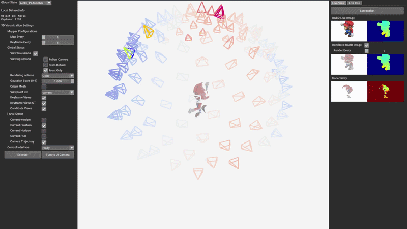

<p align="center">

  <h2 align="center">ObjSplat: Geometry-Aware Gaussian Surfels<br>for Active Object Reconstruction</h2>
  <p align="center">
    <a href="https://li-yuetao.github.io/"><strong>Yuetao Li</strong></a>
    ·
    <a href="https://github.com/dspangpang"><strong>Zhizhou Jia</strong></a>
    ·
    <a href="https://github.com/zy1490"><strong>Yu Zhang</strong></a>
    ·
    <a href=""><strong>Qun Hao</strong></a>
    ·
    <a href="https://scholar.google.nl/citations?hl=en&user=GDQ23eAAAAAJ&view_op=list_works"><strong>Shaohui Zhang</strong></a>
  <p align="center">
        Beijing Institute of Technology
  </p>

<h3 align="center">
    <a href="https://ieeexplore.ieee.org/document/11552769">  </a>
    <a href="https://arxiv.org/abs/2601.06997" target="_blank">
    </a>
    <a href="https://li-yuetao.github.io/ObjSplat-page/" target="_blank">
    </a>
    <a href="https://opensource.org/licenses/MIT" target="_blank">
    </a>
</h3>
<div align="center"></div>

<div align=center>  </div>

<span class="dperact">ObjSplat</span> autonomously plans viewpoints and progressively reconstructs an unknown object into a high-fidelity Gaussian model and water-tight mesh, enabling direct use in physics simulations.

## 💡 News
* **[9 June 2026]** 🚀 Initial public release of **ObjSplat**, including the Gazebo-based active object reconstruction pipeline.
* **[30 May 2026]** 🎉 Our paper **ObjSplat** has been accepted to **IEEE T-ASE 2026**!

## 📌 TODO

- [x] Release the core ObjSplat framework and Gazebo simulation pipeline.
- [ ] Release the robot arm and turntable control modules in the Gazebo-based environment.

## 🛠️ Installation
### Clone Repository

```bash
mkdir -p ~/Workspace/objsplat_ws/src
git clone https://github.com/Li-Yuetao/ObjSplat.git ~/Workspace/objsplat_ws/src/objsplat && cd ~/Workspace/objsplat_ws/src/objsplat
git submodule update --init --progress
# objsplat_robot for Gazebo simulation
git clone https://github.com/Li-Yuetao/objsplat_robot.git ~/Workspace/objsplat_ws/src/objsplat_robot
```

### Create Environment

```bash
conda create --name objsplat python==3.10
conda activate objsplat
pip install torch==2.3.1 torchvision==0.18.1 torchaudio==2.3.1 --index-url https://download.pytorch.org/whl/cu118
pip install -r requirements.txt
```

### Install Submodules

Gaussian Surfels Renderer
```bash
# Gaussian surfels with confidence
pip install -e submodules/diff-gaussian-rasterization_2d --no-build-isolation
# simple-knn
pip install -e submodules/simple-knn --no-build-isolation
```

Grounded-SAM2

```shell
export CUDA_HOME=/usr/local/cuda-11.8/
pip install -e submodules/Grounded-SAM-2 --no-build-isolation
pip install -e submodules/Grounded-SAM-2/grounding_dino --no-build-isolation
```

Download the Grounded-SAM2 and GroundingDINO checkpoints following the official repository instructions, and place them into the corresponding folders, such as: `checkpoints/sam2.1_hiera_large.pt`, `gdino_checkpoints/groundingdino_swint_ogc.pth`.

### Build

```bash
cd ~/Workspace/objsplat_ws/ && catkin_make -DPYTHON_EXECUTABLE=/usr/bin/python3
echo "source ~/Workspace/objsplat_ws/devel/setup.bash" >> ~/.bashrc
```

## 📦 GSO Dataset
### Download

We provide the processed 16-object subset used in our experiments: [Google Drive Link](https://drive.google.com/file/d/1pjHP6UYVLcZzRzaV2U6itagNw6SjGk_H/view?usp=drive_link). After downloading, extract the dataset into:

<details>
  <summary>[Datasets folder structure (click to expand)]</summary>

```
  src/objsplat_robot/objsplat_robot_gazebo/object_models
    ├── GSO
    │   ├── BUNNY_RACER
    │   │   ├── model.sdf
    │   │   ├── meshes
    │   |   |   └── model.obj
    │   │   └── ...
    │   └── ...
    └── ...
```
</details>

```bash
# Add the GSO models to Gazebo model path
GSO_MODELS_DIR=~/Workspace/objsplat_ws/src/objsplat_robot/objsplat_robot_gazebo/object_models/GSO
echo "export GAZEBO_MODEL_PATH=\$GAZEBO_MODEL_PATH:$GSO_MODELS_DIR" >> ~/.bashrc
```


## 🚀 Run

### 1. Launch Gazebo Simulation

```bash
# Gazebo simulation with/without GUI
roslaunch objsplat_robot_gazebo objsplat_robot_scan_empty_world.launch gui:=true
# Segmentation (in objsplat conda environment)
roslaunch objsplat seg.launch config:="${PWD}/src/objsplat/config/datasets/simcam_gsmap.json"
```

### 2. Single object
```bash
# Add a single object into the Gazebo simulation (e.g. BUNNY_RACER, Sootheze_Cold_Therapy_Elephant etc.)
rosrun objsplat_robot_gazebo add_object_node.py --model_type GSO --model_name BUNNY_RACER --pose "0 0 0.01 0 0 0 1"
# If you want to save runtime data, you can add the `save_runtime_data:=1` flag, and `hide_mapper_windows:=1` flag for headless mode.
# e.g. BUNNY-RACER
roslaunch objsplat sim.launch object_id:=BUNNY-RACER
# e.g. Elephant
roslaunch objsplat sim.launch object_id:=Elephant hide_mapper_windows:=1 save_runtime_data:=1
```

### 3. Batch objects
```bash
# Add object service node
rosrun objsplat_robot_gazebo add_object_service_node.py
# Run all 16 objects
rosrun objsplat run_all.py
```

## 📊 Evaluation
```bash
rosrun objsplat eval_geometry.py --results_dir ./results --iteration -1
```

## ✏️ Acknowledgments

Our implementation is built upon <a href="https://github.com/Li-Yuetao/ActiveSplat">ActiveSplat</a>. We would also like to thank the authors of the following open-source repositories:

- <a href="https://github.com/turandai/gaussian_surfels">GaussianSurfels</a> for the differentiable Gaussian rasterization.
- <a href="https://github.com/muskie82/MonoGS">MonoGS</a> for the online gaussian map visualization.
- <a href="https://github.com/dmar-bonn/active-gs">ActiveGS</a> for the confidence map visualization.
- <a href="https://github.com/dspangpang/pb_nbv">PB-NBV</a> for Gazebo-based simulation environment.
- <a href="https://github.com/IDEA-Research/Grounded-SAM-2">Grounded-SAM-2</a> for object segmentation.

If you find these works helpful, please consider citing them as well.

## 🎓 Citation

If you find our code/work useful in your research, please consider citing the following:
```bibtex
@article{li2026objsplat,
    title={ObjSplat: Geometry-Aware Gaussian Surfels for Active Object Reconstruction},
    author={Li, Yuetao and Jia, Zhizhou and Zhang, Yu and Hao, Qun and Zhang, Shaohui},
    journal={IEEE Transactions on Automation Science and Engineering},
    year={2026},
    publisher={IEEE}
}
```