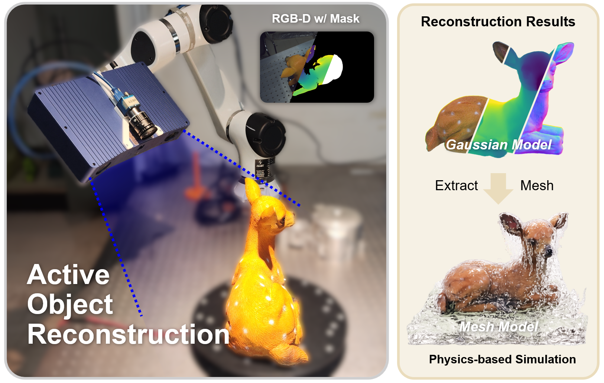

## ObjSplat: Geometry-Aware Gaussian Surfels for Active Object Reconstruction
#### [[Website]](https://li-yuetao.github.io/ObjSplat-page/) [arXiv] [Paper (PDF)]  [Video]

> The paper and video will be updated soon...

[Yuetao Li](https://li-yuetao.github.io/), [Zhizhou Jia](https://github.com/dspangpang), [Yu Zhang](https://github.com/zy1490), [Qun Hao](), [Shaohui Zhang](https://scholar.google.com/citations?hl=zh-CN&user=GDQ23eAAAAAJ)

Beijing Institute of Technology

  

ObjSplat autonomously plans viewpoints and progressively reconstructs an unknown object into a high-fidelity Gaussian model and water-tight mesh, enabling direct use in physics simulations.

This is the official repository for ObjSplat.

The code will be released soon—stay tuned!